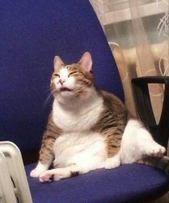

# FriendLLy


<!-- WARNING: THIS FILE WAS AUTOGENERATED! DO NOT EDIT! -->

## Install

``` sh
pip install friendlly
```

## How to use

``` python
import os
# os.environ['ANTHROPIC_API_KEY'] = 'your-very-secret-anthropic-api-key'

# Or even better, use dotenv instead:
# (assuming you have an .env file with 'ANTHROPIC_API_KEY=your-very-secret-anthropic-api-key' in it)
import dotenv; dotenv.load_dotenv("../.env");
```

------------------------------------------------------------------------

    %load_ext friendlly

``` python
# %%fr 
# Download an image of a cat, resize to 250 on long side, then very briefly describe it in the style of Jeremy Howard
```

Certainly! I’ll download an image of a cat, resize it, and then describe
it briefly in Jeremy Howard’s style. Let’s break this down into steps:

<details>
<summary style="display: list-item">
🧠
</summary>

1.  We’ll use the requests library to download an image.
2.  We’ll use PIL (Python Imaging Library) to process and resize the
    image.
3.  After resizing, we’ll display the image.
4.  Then, I’ll provide a brief description in Jeremy Howard’s style.

</details>

``` python
# %%fr +2 reply
import requests
from PIL import Image
from io import BytesIO

# Download an image of a cat
url = "https://cataas.com/cat"
response = requests.get(url)
img = Image.open(BytesIO(response.content))

# Resize the image
max_size = 250
ratio = max_size / max(img.size)
new_size = tuple([int(x*ratio) for x in img.size])
resized_img = img.resize(new_size, Image.LANCZOS)

# Display the resized image
resized_img
```



Alright, let’s describe this image in Jeremy Howard’s style:

“Right, so we’ve got this absolutely cracking image of a cat here. It’s
a proper chonker, sitting on what looks like a blue chair or sofa. The
cat’s got this brilliant tabby pattern - you know, those classic
stripes - and a white belly. And get this, it’s doing that classic cat
thing where it’s squinting its eyes, looking all content and smug. It’s
like it’s saying, ‘Yeah, I own this place.’ Brilliant stuff, really.
This is exactly the kind of image that would make for a fantastic
dataset in computer vision tasks. You could use it for all sorts of
things - cat breed classification, pose estimation, you name it.
Absolutely fascinating, isn’t it?â€
