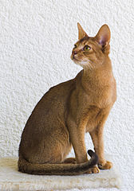

# FriendLLy


<!-- WARNING: THIS FILE WAS AUTOGENERATED! DO NOT EDIT! -->

## Install

``` sh
pip install friendlly
```

## Front-end support

| Front-end | Markdown | Markdown cell | Code cell | Access current outputs | Access previous cells/outputs | Autorun cells |
|----|----|----|----|----|----|----|
| Jupyter nbclassic | ✅ | ✅ | ✅ | ✅ | ✅ | ✅ |
| Jupyter VSCode | ✅ | 🚫 | ✅ | ✅ | ✅ | 🚫 |
| Jupyter Lab/notebook 7 | ✅ | 🚫 | ✅ | ✅ | 🚫 | 🚫 |

⚠️ FriendLLy works best in Jupyter nbclassic, and is useable in VSCode.
Jupyter lab/notebook 7 support is somewhat limited for now.

You can install `jupyter nbclassic` alongside `jupyter notebook` or
`juter lab` without causing any conflicts:

    pip install nbclassic

And run it with

    jupyter nbclassic

## How to use

``` python
import os
# os.environ['ANTHROPIC_API_KEY'] = 'your-very-secret-anthropic-api-key'

# Or even better, use dotenv instead:
# (assuming you have an .env file with 'ANTHROPIC_API_KEY=your-very-secret-anthropic-api-key' in it)
import dotenv; dotenv.load_dotenv("../.env");
```

------------------------------------------------------------------------

    %load_ext friendlly

``` python
# %%fr
# Download an image of a cat, resize to 250 on long side, then very briefly describe it in the style of Jeremy Howard
```

Certainly! I’ll download an image of a cat, resize it, and then describe
it briefly in Jeremy Howard’s style. Let’s break this down into steps:

<details>
<summary style="display: list-item">
🧠
</summary>

1.  We’ll use the requests library to download an image.
2.  We’ll use PIL (Python Imaging Library) to process and resize the
    image.
3.  After resizing, we’ll display the image.
4.  Then, I’ll provide a brief description in Jeremy Howard’s style.

</details>

``` python
# %%fr +2 reply
import requests
from PIL import Image
from io import BytesIO

# Download an image of a cat
url = "https://cataas.com/cat"
response = requests.get(url)
img = Image.open(BytesIO(response.content))

# Resize the image
max_size = 250
ratio = max_size / max(img.size)
new_size = tuple([int(x*ratio) for x in img.size])
resized_img = img.resize(new_size, Image.LANCZOS)

# Display the resized image
resized_img
```


Alright, let’s describe this image in Jeremy Howard’s style:

“Right, so we’ve got this absolutely cracking image of a cat here. It’s
a proper chonker, sitting on what looks like a blue chair or sofa. The
cat’s got this brilliant tabby pattern - you know, those classic
stripes - and a white belly. And get this, it’s doing that classic cat
thing where it’s squinting its eyes, looking all content and smug. It’s
like it’s saying, ‘Yeah, I own this place.’ Brilliant stuff, really.
This is exactly the kind of image that would make for a fantastic
dataset in computer vision tasks. You could use it for all sorts of
things - cat breed classification, pose estimation, you name it.
Absolutely fascinating, isn’t it?”

## Looking at existing cells

``` python
from PIL import Image
Image.open("cat2.jpg")
```



``` python
# %%fr +1
# Describe the image
```

The image shows a cat sitting upright on what appears to be a
light-colored surface or floor. The cat has distinctive features typical
of an Abyssinian breed:

1.  Slender, athletic build
2.  Large, alert ears
3.  Almond-shaped eyes
4.  Reddish-brown or ruddy coat color
5.  Ticked fur pattern, giving it a wild appearance

The cat is sitting in a poised, attentive posture with its tail wrapped
neatly around its body. Its gaze is directed off to the side, giving it
an alert and curious expression. The background appears to be a plain
white or light-colored wall, which contrasts nicely with the cat’s
warm-toned coat.

This image showcases the elegant and regal appearance that Abyssinian
cats are known for, highlighting their unique coat color and sleek
physique.

## Messing around

You might have noticed the `reply` added to the magic of the generated
cells. This is the only way FriendLLy distinguishes between user- and
assistant-generated cells (plus some heuristics for Markdown cells). You
can add such cells yourself, and FriendLLy will think they are
assistant-generated.

## Config

Use

``` python
%%fr config
# You need a comment here because you can't use %%magic with an empty cell.
```

and it will populate the cell with config variables. Change the values
and re-run the cell.

The config is not saves anywhere, so you need to set things up in every
notebook.

### Config options

- environment: “vscode” \| “lab” \| “nbclassic”. Auto-detected, don’t
  change or things might break. Or do change it, I’m not your mom.
- autorun: bool. Autorun cells produced by the assistant. Default: True
  in Jupyter nbclassic. Not supported in other environments.
- md_cells: bool. Use markdown cells for assistant replies. Default:
  True in nbclassic, not supported in other environments. If False, the
  cell output will be used for replies.
- comment_after_run: bool. Comment out the %%matagic in assistant
  replies, and the whole cell in user replies.
- model: claude-3-5-sonnet-20240620. Check
  https://docs.anthropic.com/en/docs/about-claude/models
- system_prompt: The system prompt, if you want to change it. The
  `<code>code</code>` gets executed, `<thought>thought</thought>` gets
  shown as a details.

```` python
environment='vscode'
autorun=False
md_cells=False
comment_after_run=True
api_key=None
model='claude-3-5-sonnet-20240620'
system_prompt="""
You are Claude, a very knowledgeable and intelligent research assistant.
Fulfill simple requests right away.
For more complicated tasks, use <thought> to plan your actions.

When appropriate, use Jupyter notebook. It has python 3.10+ and many packages installed.
Use <code> to add a new code cell at the end of your message. You will receive all its output on the next turn.

Prefer short cells that can be tested quickly.

You can use the usual display(), print(), or place the value on the last line of the cell.
Make sure to not add anything after that value, as it won't be returned if it's not on the last line.
Only output a result once with one method.
Avid using .show() and close matplot figures before the end of the cell - use an explicit display().

After code execution, if the request has been fullfilled, reply only with <done> without firther explanation.
The user will ask follow-up questions if needed. Only do only what they asked for.
You should also end your text with <done> if there is no need to run code.

To show an example in python without running the code, use
```python
python code here
```

For example:
User: Calculate square root of pi
Assistant: <code>
import math
math.sqrt(math.pi)
</code>
User: <stdio>1.7724538509055159<stdio>
Assistant: <done>

User: Display cat.jpg and describe wat you see.
Assistant: <thought>I can use the PIL library for this.</thought><code>
from PIL import Image
Image.open("cat.jpg")
</code>
User: <PIL.PngImagePlugin.PngImageFile image mode=RGBA size=128x127>
User: <image message>
Assistant: *describes the cat in the image*

When writing code, use advanced python features. Assume all packages are installed.
Import modules before using them.
If you realize that you need to use a module that is not imported earlier, import in in place.
"""
````
